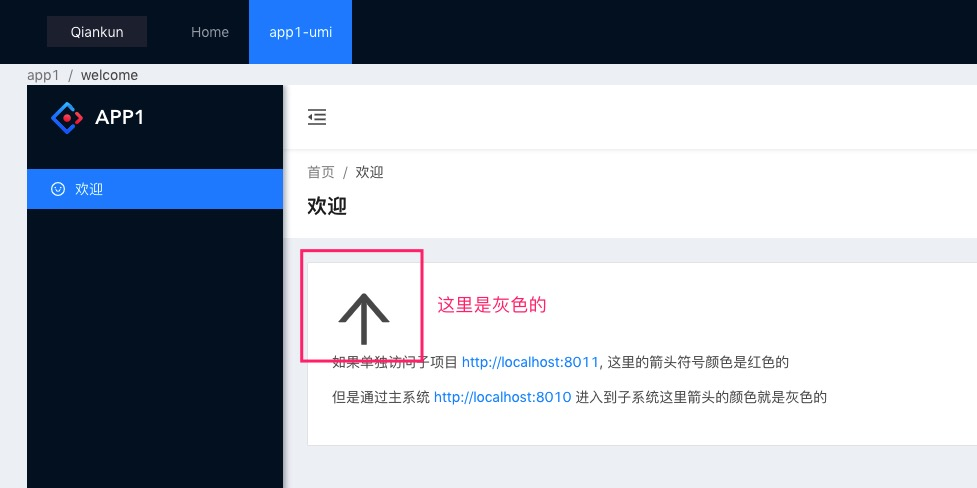
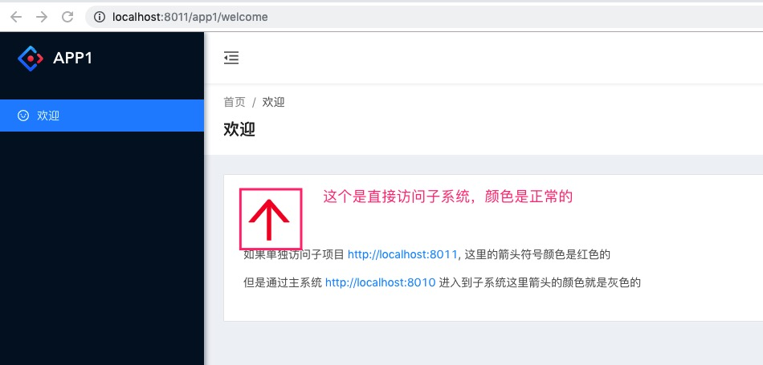

#### 问题复现步骤

* 分别为 2 个项目先安装依赖包
* 在根目录下执行 `yarn start`
* 访问 [http://localhost:8010](http://localhost:8010), 将会看到

这里箭头的符号颜色是灰色，是不正确的
* 直接访问子系统地址 [http://localhost:8011](http://localhost:8011), 将会看到

这里的箭头符号颜色才是正确的
